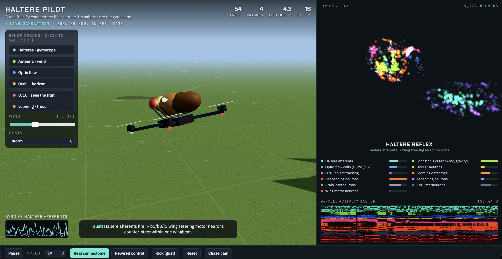
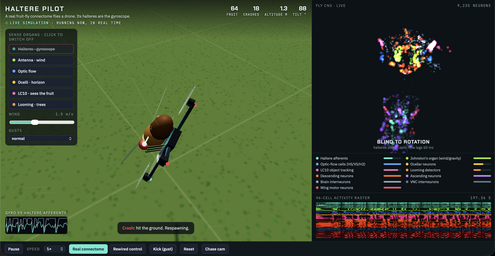
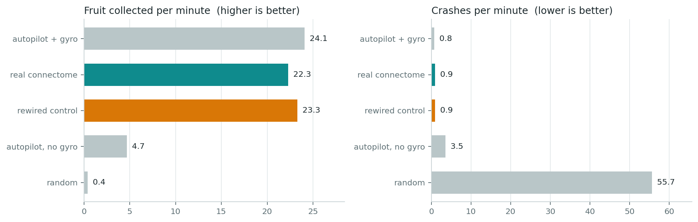
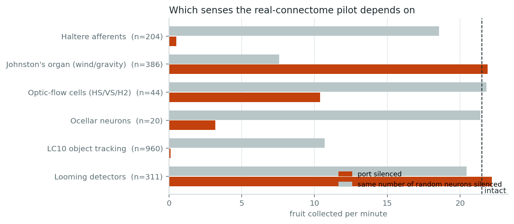
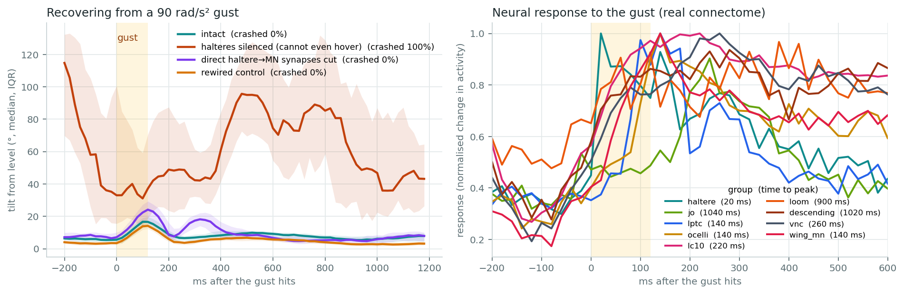
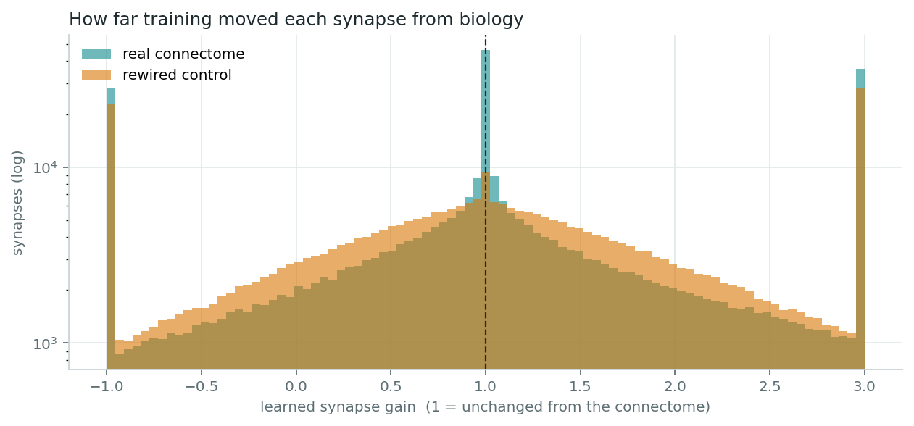

# Haltere Pilot

**A connectome-constrained flight controller: the *Drosophila* male CNS connectome flying a simulated
quadrotor, with the drone's gyroscope wired into the fly's haltere afferents.**



Most "connectome in a simulation" demos inject the task signal into whichever neurons are convenient,
so the fly's wiring is decoration. This project takes the anatomy seriously: **every drone sensor enters
the network at the afferent population that carries that signal in a real fly, and the motor commands are
read out of real wing motor neurons.** Everything between the two is the measured connectome
(neuPrint `male-cns:v1.0`, Janelia FlyEM).

Two questions follow from that setup:

1. Can the real wiring be tuned into a working flight controller at all?
2. Once it can fly, **which pathways does it actually use** — and do they match the ones flies use?

The short answers: yes, it flies at 93% of its teacher's score; and the pathway it depends on most is the
haltere → wing-steering reflex arc that keeps real flies airborne. Silencing 204 haltere neurons turns a
clean flight into a crash every second, while silencing 204 random neurons changes almost nothing.

---

## Quickstart: run the live simulation

The simulation is **live**, not a video: Python integrates the drone's rigid-body dynamics and the
9,235-neuron network at 50 Hz and streams each step to a three.js viewer in the browser. The drone flies
until it crashes, respawns, and keeps going.

**macOS / Linux**

```bash
git clone https://github.com/Ameerkhanjk/haltere-pilot.git
cd haltere-pilot
python3 -m pip install -r requirements.txt
python3 -m flydrone.live
```

**Windows (PowerShell or Command Prompt)**

```bat
git clone https://github.com/Ameerkhanjk/haltere-pilot.git
cd haltere-pilot
python -m pip install -r requirements.txt
python -m flydrone.live
```

The browser opens at `http://127.0.0.1:8765` after a few seconds of warm-up. Keep the terminal window
open; `Ctrl+C` there stops the simulation. There are also double-click launchers:
`run_live_mac.command` and `run_live_windows.bat`.

A trained controller ships with the repo, so nothing needs training first. The server binds to
`127.0.0.1` only.

> Opening `viewer/index.html` directly (without Python) gives a **recorded replay** of three short
> flights that loops. It is a fallback for looking at the project without installing anything — the live
> simulation is the real thing.

### Things worth trying in the viewer

The panel on the left silences individual afferent populations *while the controller is flying* — the
same manipulation as the ablation experiment below, but interactive.

| Action | What happens |
|---|---|
| Click **Halteres · gyroscope** | The drone tumbles within a second or two and crashes repeatedly: body rotation now only reaches the brain through 60 ms-delayed vision. |
| Click **LC10 · sees the fruit** | Flight stays stable, but it stops finding targets — stability and navigation are separable. |
| Click **Ocelli · horizon** | Noticeably more wobble and crashes, from silencing only 20 neurons. |
| **Kick (gust)** | Applies a torque impulse; watch the haltere trace and the wing motor neuron bar spike as the reflex counter-steers. |
| **Rewired control** | Swaps in the degree-preserving shuffled-wiring controller mid-flight. |
| **Wind** / **Gusts** | Turbulence strength and gust frequency. |



*Halteres silenced from the panel: 145° tilt, crash counter climbing, and the brain panel reads FLYING
BLIND. The haltere bar drops to baseline while the rest of the network keeps running.*

---

## Method

### Subnetwork selection

The full male CNS connectome is 163,903 neurons — too large to train on a laptop — so the network is
restricted to neurons that can plausibly participate in this sensorimotor loop: **every neuron lying on a
path of ≤ 3 synapses from an input port to a wing motor neuron** (connections of ≥ 5 synapses only).
That yields **9,235 neurons and 332,785 connections**, including 696 descending neurons and 3,244
ventral-nerve-cord interneurons.

Worth noting from the data itself: haltere afferents synapse **directly** onto the wing steering motor
neurons b1, b3 and i1 (254 connections, ~2,600 synapses). That monosynaptic arc is a known fast
stabilisation reflex in flies, and it falls out of the connectome without being put there by hand.

### Sensor → afferent mapping

| Drone sensor | Afferent population it drives | n | Latency |
|---|---|---|---|
| Gyroscope (body angular velocity) | Haltere afferents (`SApp`, `SNpp*`) | 204 | none |
| Airspeed + specific force | Johnston's organ wind/gravity neurons (`JO-C/E`) | 386 | none |
| Horizon / attitude | Ocellar projection neurons (`OCG01–03`) | 20 | 40 ms |
| Optic flow | Lobula plate tangential cells (`HS`, `VS`, `H2`) | 44 | 60 ms |
| Target bearing | `LC10` object-tracking neurons | 960 | 60 ms |
| Obstacle expansion | Looming detectors (`LPLC2`, `LC4`) | 311 | 60 ms |
| **Actions ←** | **Wing motor neurons** (`DLMn`/`DVMn`, `b1–3`, `i1–2`, `iii1/3`, `hg1–4`, …) | **67** | |

Input weights are block-masked by modality, so the gyroscope signal can *only* enter through haltere
afferents. The latencies matter: vision is slow in flies, and making the visual channels lag reproduces
the regime in which halteres are indispensable. Note also that an antenna, like any accelerometer,
measures specific force rather than gravity, so it says little about tilt during flight — the halteres are
the only instantaneous rotation sense in the model, as in the animal.

### Neuron and network model

Each neuron is a leaky, rectified rate unit,

```
r_t     = tanh(relu(gain · Σ_j w_ij r_j + b_i + drive_i))
h_{t+1} = (1 − α_i) h_t + α_i r_t
```

with three synaptic updates per 20 ms control step (≈ 7 ms per hop). Weights are initialised from
log-scaled synapse counts, normalised per postsynaptic neuron, and signed by the predicted
neurotransmitter (ACh excitatory; GABA/glutamate inhibitory — 36% of connections). Training learns a
multiplicative gain per synapse, a bias and a time constant per neuron, the afferent tuning and a linear
readout from the wing motor neurons. **It cannot add connections that do not exist in the connectome.**

### Task and physics

A batched quadrotor simulator in PyTorch: thrust plus body torques, aerodynamic drag, Ornstein–Uhlenbeck
turbulence, discrete gusts, cylindrical obstacles, and target "fruit" to reach. Rotational dynamics are
deliberately fast and lightly damped, fly-like rather than drone-like. The sanity check for that choice is
in `flydrone/baselines.py`: a hand-tuned cascaded autopilot scores 24.1 fruit/min with gyro feedback but
only 4.7 when restricted to delayed visual rate estimates.

### Training

The controller is trained by **DAgger imitation** of that gyro-equipped autopilot: the network flies, the
teacher (which sees privileged state) labels the action it would have taken, and the teacher's share of
control decays to zero, so the network learns to recover from its own mistakes. ~13 min on an M3 Pro.

This is worth stating plainly: *"the fly brain learned to fly"* here means **the real wiring can be tuned to
reproduce a good controller**. The informative results are the ablations and the reflex-arc manipulation,
which are properties of the trained solution rather than of the training signal.

### Control

A **degree-preserving rewired control** is trained identically: same neurons, same synapse counts, same
signs, same afferent and motor ports — connections shuffled. Without it, none of the comparisons mean
anything.

---

## Results

All numbers from `results_drone/analysis.json`, regenerate with `python3 -m flydrone.analyze`.

| Controller | Fruit / min | Crashes / min |
|---|---|---|
| Autopilot with gyro (teacher, privileged state) | 24.1 | 0.75 |
| **Real connectome** | **22.3** | **0.94** |
| Rewired control | 23.3 | 0.91 |
| Autopilot without gyro | 4.7 | 3.53 |
| Random actions | 0.4 | 55.7 |



**1. The real wiring flies — but so does the shuffled one.** The connectome controller reaches 93% of its
teacher's score with zero ground crashes and a mean tilt under 10°. The rewired control matches it. On
raw task performance, at this network size, the real wiring confers no advantage, and I'd rather report
that than bury it.

**2. Ablations recover fly biology.**



| Silenced population | Fruit / min | Crashes / min | Size-matched random silencing |
|---|---|---|---|
| Halteres (204) | 0.5 | 62.8 | 18.6 fruit, 1.4 crashes |
| Ocelli (20) | 3.2 | 4.6 | 21.4 fruit, 1.5 crashes |
| Optic flow (44) | 10.4 | 8.9 | 21.8 fruit, 1.1 crashes |
| LC10 (960) | 0.1 | 1.4 | 10.7 fruit, 1.2 crashes |
| Johnston's organ (386) | 21.9 | 1.5 | 7.6 fruit, 1.1 crashes |
| Looming (311) | 22.2 | 0.9 | 20.4 fruit, 1.8 crashes |

Halteres are load-bearing; random neurons of the same number are not. Stability (halteres, ocelli, optic
flow) and navigation (LC10) dissociate cleanly. The antenna and looming channels went unused — the
teacher never needed them, so the student never learned to read them.

**3. Cutting the monosynaptic reflex arc degrades gust recovery.**



Deleting *only* the 254 direct haltere → wing-motor-neuron connections — 0.08% of the network — while
leaving the afferents and every other pathway intact raises peak tilt after a 90 rad/s² gust from ~17° to
~25°, and tilt at 300 ms from ~7° to ~17°. The trained controller routes a substantial part of its
stabilisation through the same one-hop arc flies use.

**4. The real wiring needed fewer changes to get there.**



Training moved 78% of the real network's synaptic gains by > 10% (median |Δ| 0.61), versus 91% (median
0.73) for the rewired control. Suggestive that the measured wiring starts closer to a working flight
controller — but this is one seed per condition and needs replication before it means anything.

---

## Reproducing

```bash
python3 -m flydrone.baselines              # reference pilots, ~5 s
python3 -m flydrone.train --graph real     # ~13 min (M3 Pro)
python3 -m flydrone.train --graph rewired  # ~15 min
python3 -m flydrone.analyze                # experiments + figures, ~5 min
python3 -m flydrone.record                 # refresh the replay episodes, ~1 min
```

Trained weights for both conditions are in `results_drone/`, so `analyze`, `record` and `live` work
without training. On Windows use `python` instead of `python3`.

Rebuilding the subnetwork from the raw connectome needs a free [neuPrint](https://neuprint.janelia.org)
account (Account → Auth Token):

```bash
export NEUPRINT_TOKEN="..."     # Windows: setx NEUPRINT_TOKEN "..."
python3 -m flydrone.download    # ~30 MB, not tracked in git
rm connectome_cache/flight_graph_*.npz
python3 -m flydrone.connectome
```

Never commit that token.

---

## Repository layout

| Path | Contents |
|---|---|
| `flydrone/connectome.py` | Subnetwork extraction, port definitions, rewiring control |
| `flydrone/env.py` | Quadrotor dynamics, wind/gusts, sensor latencies, reference autopilots |
| `flydrone/policy.py` | Connectome-constrained rate network + critic |
| `flydrone/train.py` | DAgger training loop |
| `flydrone/analyze.py` | Ablations, gust impulse test, reflex-arc cut, synapse drift, figures |
| `flydrone/live.py` | **Live simulation server** — real-time physics + network, streamed to the viewer |
| `flydrone/record.py` | Episode recording for the offline replay |
| `flydrone/baselines.py` | Hand-written reference controllers |
| `flydrone/download.py` | neuPrint download helper |
| `viewer/index.html` | three.js viewer (live mode, or replay from `viewer/data/`) |
| `connectome_cache/` | Prebuilt 9,235-neuron flight subnetwork (1.1 MB) |
| `results_drone/` | Trained weights, figures, `analysis.json` |
| `docs/` | Project guide and run guide (PDF) |
| `notebooks/` | Earlier 2-D foraging experiment this grew out of |

---

## Limitations

- The early visual pathway (photoreceptors → T4/T5 motion detectors) is not simulated. Optic flow is
  injected at the tangential cells that normally receive it, which is a computation-level shortcut.
- Rate units, not spiking neurons; no dendritic structure, no conduction delays beyond the per-hop tick.
- Neurotransmitter signs are predictions, not measurements.
- One seed per condition. The real-vs-rewired synaptic-drift difference in particular needs replication.
- The connectome is one individual male fly; the task is a quadrotor, not fly aerodynamics.

## Data and credit

Connectome data: male *Drosophila melanogaster* CNS, Janelia Research Campus / FlyEM, accessed through
[neuPrint](https://neuprint.janelia.org) (`male-cns:v1.0`). Please cite the dataset publication if you use
it. This repository contains a derived subnetwork, not the source dataset.

Code released under the MIT License (see `LICENSE`).
